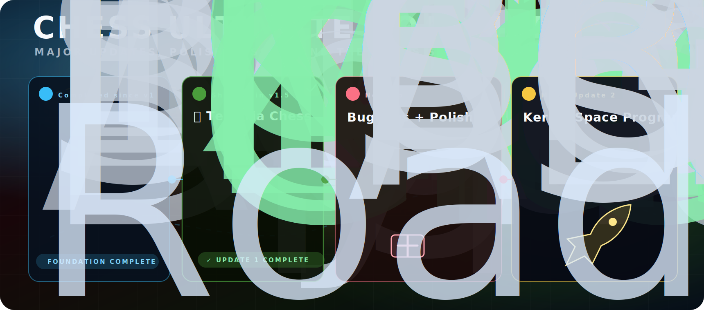
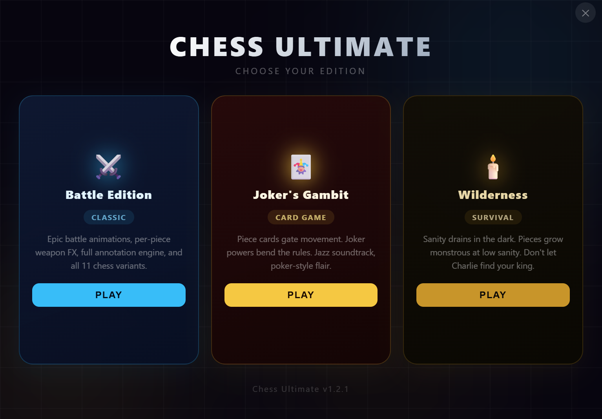
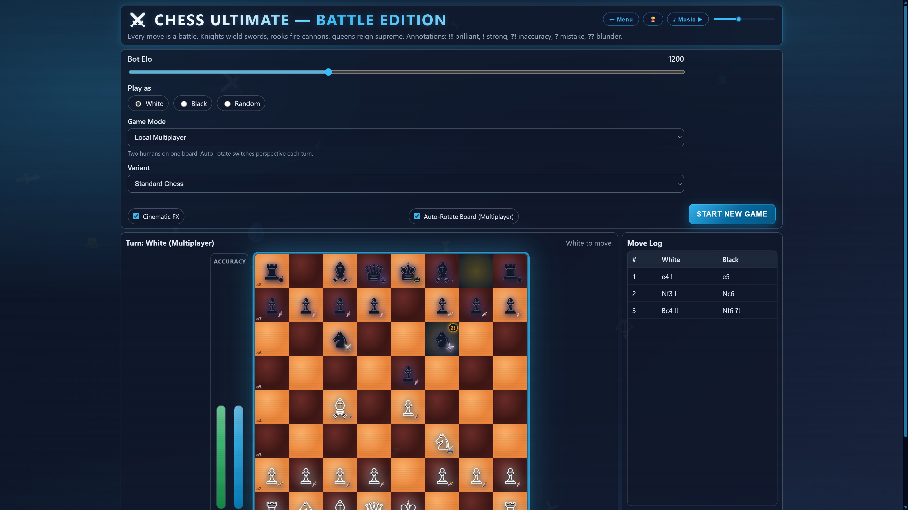
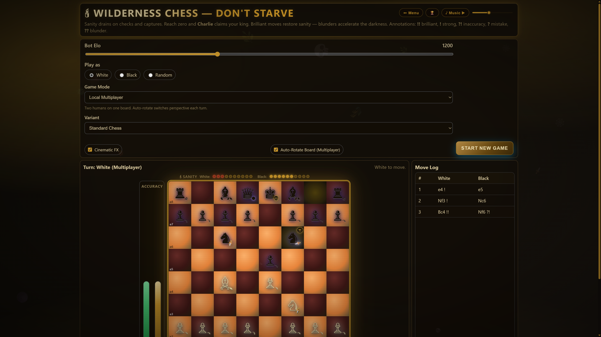

<h1 align="center">Chess Ultimate</h1>

<p align="center"><strong>Four cinematic chess editions with reactive procedural soundtracks.</strong></p>
<p align="center">Made by <strong>TheHollyCow</strong> and <strong>Masternazz</strong>.</p>

<p align="center">
  <a href="https://github.com/Flopper1-1/Chess-Ultimate/releases">
    
  </a>
</p>

<p align="center">
  
</p>

<p align="center">
  
</p>

## ⚔️ Four Editions

### **Battle Edition**



- Classic chess with per-piece weapon effects, screen shake, and cinematic move arcs.
- Full annotation engine with brilliant moves, blunders, accuracy meters, and move badges.
- Includes the main chess variant suite, from Atomic to Fog of War to 4-player boards.

### **Joker's Gambit**


- Balatro-inspired piece cards gate movement and turn every move into a wager.
- Jokers, luck cards, reward rolls, rarity tiers, and passive or active powers bend the rules.
- Jazz-club presentation with card-table UI, suit bursts, and gambling-flavored momentum.

### **Wilderness**



- Don't Starve-inspired sanity meters react to checks, captures, blunders, and brilliant moves.
- The board darkens as sanity falls, with nightmare filters and survival pressure.
- Eerie wilderness audio layers drones, crickets, heartbeat pulses, and sudden horror stingers.

### **Terraria Chess** *(new in v1.5)*

- Class system: K/R/N are Warriors, Q/B are Mages, P are Rangers — each with themed weapon overlays.
- Capture pieces to earn XP. Level up your king from Spawn → Guide → Hardmode → Moon Lord.
- XP thresholds: Pawn=10, Knight/Bishop=20, Rook=30, Queen=50. Levels at 50 / 100 / 150 XP.
- Class combo detection: two consecutive captures with the same class triggers a combo burst.
- 140 BPM D-major chiptune with square-wave arpeggios, NES-style bass, and boss drone at high tension.
- Green/copper visual theme with king level-up banners and ore-pickup sound FX.

## ✨ Features

- **Procedural Web Audio music** — no audio files; every edition has its own synthesized score.
- **Reactive tension system** — captures, checks, promotions, blunders, and game over events reshape BPM, filters, percussion, and counter-melodies in real time.
- **Cinematic animations** — arcing piece movement, landing flashes, capture bursts, screen shake, and themed FX.
- **11 chess variants** — Standard, Chess960, Three-Check, Atomic, King of the Hill, Fog of War, Antichess, Crazyhouse, Checkers vs Chess, Bughouse, and more.
- **Annotation engine** — real-time `!!`, `!`, `?!`, `?`, and `??` labels with per-side accuracy tracking.
- **4-player chess** — teams and free-for-all modes on a 14×14 board.
- **Balatro card system** — piece hands, jokers, luck cards, reward chances, rarity rolls, and card-driven movement.
- **Don't Starve sanity mechanic** — sanity bars, darkness states, Charlie pressure, and survival-flavored consequences.
- **Terraria XP system** — class-based XP bars, king level progression, and combo chains.
- **Discord Rich Presence** — optional activity status for launcher, edition, variant, mode, move count, and results.

## 🎵 Soundtracks

| Edition | Style | Tempo | Harmony | Signature Texture |
|---|---:|---:|---|---|
| Battle | War march | 108 BPM | A minor modal | Distorted brass, double-kick drums, snare rolls |
| Joker's Gambit | Jazz | 92 BPM | Cm7-Fm7-Bb7-Ebmaj7 | Swing groove, brushed percussion, sly counter-melody |
| Wilderness | Eerie Phrygian drone | 60 BPM | A Phrygian | Cricket textures, heartbeat pulses, cave reverb |
| Terraria Chess | NES chiptune | 140 BPM | D major | Square-wave arpeggios, bouncy sine bass, boss drone |

## 🚀 Quick Start

```bash
git clone https://github.com/Flopper1-1/Chess-Ultimate.git
cd Chess-Ultimate
npm install
npm start
```

## 📦 Build

```bash
npm run build
```

Output: `build-out/ChessUltimate-win32-x64/ChessUltimate.exe` (zipped to `dist-pkg/`).

## 🎮 Controls

| Action | Input |
|---|---|
| Select a piece | Click a piece |
| Move | Click a legal destination |
| Drag move | Drag a piece to a square |
| Promote | Choose from the promotion picker |
| Planning arrow | Right-click drag or Shift-drag |
| Highlight square | Right-click or Shift-click |
| Select a card | Joker's Gambit: click a matching piece card |
| Music | Press the Music button |
| Menu | Press Esc or use the Menu button |
| Back to launcher | Menu → Back to Menu |

## 🧩 Tech Notes

- Electron desktop app with isolated preload APIs.
- Web Audio API synthesis for all music and SFX — zero bundled audio files.
- Local achievements stored per edition in `localStorage`.
- Discord Rich Presence is optional. Set `CHESS_ULTIMATE_DISCORD_CLIENT_ID` or place `discord-client-id.txt` next to the exe/repo with a Discord Application Client ID.
- No server required for normal play.

## License

MIT — see [LICENSE](LICENSE).
